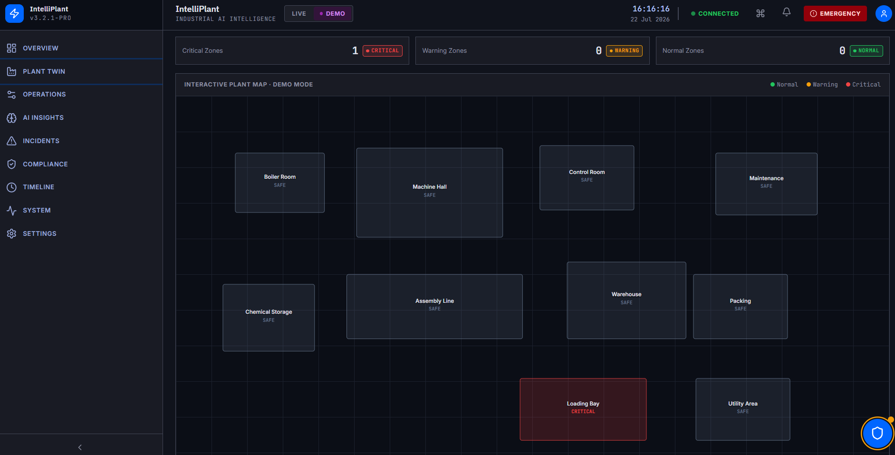
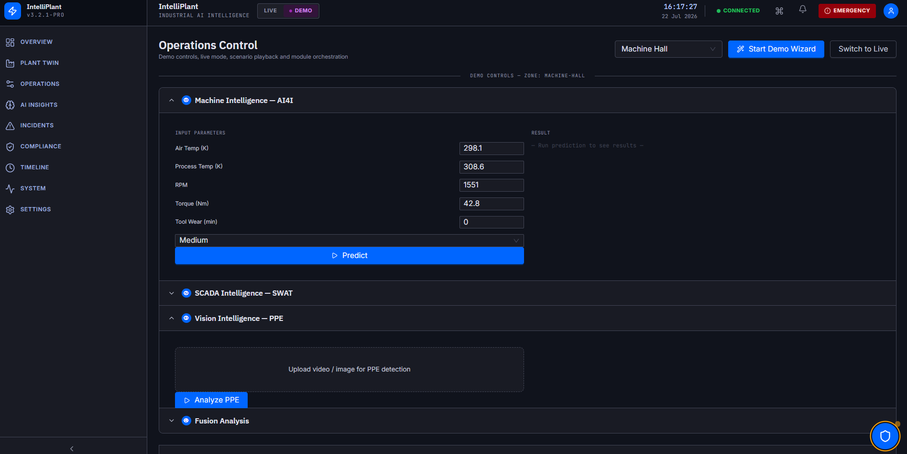
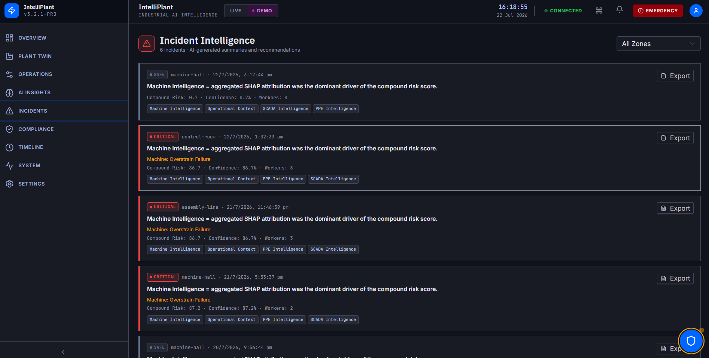
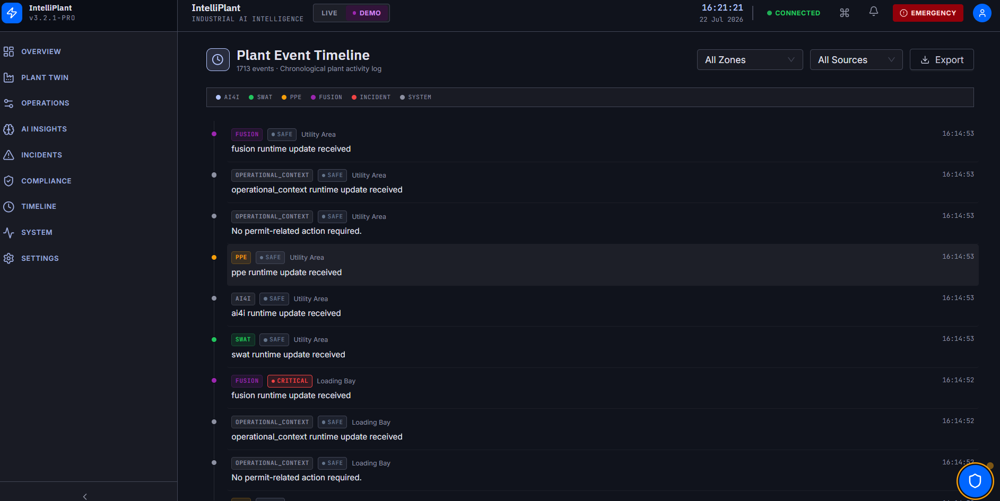

<p align="center">
  
</p>

<h1 align="center">IntelliPlant</h1>

<p align="center">
AI-Powered Industrial Safety Intelligence Platform for Zero-Harm Operations
</p>

<p align="center">
An Enterprise-Grade Industrial Intelligence Platform that unifies Machine Health, SCADA Analytics, Computer Vision, Operational Context and Regulatory Intelligence into a single predictive safety ecosystem.
</p>

<p align="center">


</p>

<p align="center">

<a href="https://github.com/vansh-tyagii/IntelliPlant">Repository</a> •
<a href="#overview">Overview</a> •
<a href="#features">Features</a> •
<a href="#architecture">Architecture</a> •
<a href="#installation">Installation</a>

</p>

---

# IntelliPlant

IntelliPlant is an AI-powered Industrial Safety Intelligence Platform designed to provide real-time predictive safety monitoring inside large industrial facilities.

Instead of analysing independent safety systems separately, IntelliPlant combines multiple AI engines into one unified decision-making pipeline capable of identifying compound industrial risks before they become critical.

The platform continuously integrates machine telemetry, industrial sensor analytics, PPE compliance, operational context and regulatory intelligence to provide safety officers with actionable recommendations, explainable AI predictions and live plant-wide situational awareness.

---

# Table of Contents

- [Overview](#overview)
- [Problem Statement](#problem-statement)
- [Why IntelliPlant](#why-intelliplant)
- [Key Features](#features)
- [System Workflow](#system-workflow)
- [Architecture](#architecture)
- [Technology Stack](#technology-stack)
- [Project Structure](#project-structure)
- [Installation](#installation)
- [Configuration](#configuration)
- [Running the Project](#running-the-project)
- [Frontend Overview](#frontend-overview)
- [Backend Overview](#backend-overview)
- [Digital Twin](#digital-twin)
- [AI Modules](#ai-modules)
- [Fusion Engine](#fusion-engine)
- [API Documentation](#api-documentation)
- [Screenshots](#screenshots)
- [Roadmap](#roadmap)
- [Contributing](#contributing)
- [License](#license)
- [Acknowledgements](#acknowledgements)

---

# Overview

Modern industrial facilities generate enormous amounts of operational data through independent systems such as:

- Machine telemetry
- Industrial SCADA systems
- CCTV surveillance
- Worker safety monitoring
- Permit-to-work records
- Maintenance activities
- Shift operations
- Compliance documentation

Most organizations analyse these systems independently.

IntelliPlant introduces an enterprise intelligence layer capable of correlating all these independent signals into a unified plant-wide risk assessment.

Instead of reacting after an incident occurs, IntelliPlant focuses on predicting compound risks and providing preventive recommendations before safety incidents escalate.

---

# Problem Statement

Industrial environments rely on multiple isolated safety systems that rarely communicate with one another.

Critical safety events often emerge only when several independent conditions occur simultaneously.

Examples include:

- Equipment degradation during maintenance
- Worker PPE violations in hazardous areas
- Sensor anomalies during shift transitions
- Active permits overlapping dangerous operations

While each subsystem may appear normal individually, their combined operational context can indicate a significant safety threat.

IntelliPlant addresses this challenge by integrating multiple AI models into a unified intelligence platform capable of identifying complex safety scenarios through multi-source data fusion.

---

# Why IntelliPlant

Unlike traditional monitoring dashboards, IntelliPlant focuses on decision intelligence rather than isolated alerts.

It provides:

- Unified industrial intelligence
- Compound risk analysis
- Explainable AI predictions
- Live operational awareness
- Geospatial plant monitoring
- Regulatory guidance
- Incident intelligence
- Enterprise-ready architecture

---

# Features

## Industrial AI

- Predictive Machine Failure Analysis
- Industrial SCADA Anomaly Detection
- PPE Compliance Monitoring
- Compound Risk Fusion
- Explainable AI
- Live Risk Scoring

---

## Operational Intelligence

- Digital Twin
- Interactive Plant Heatmap
- Zone-based Monitoring
- Live Runtime State
- Timeline Events
- Incident Generation
- System Health Monitoring

---

## Enterprise Dashboard

- Executive Overview
- Plant Operations
- AI Insights
- Compliance Assistant
- Incident Center
- Timeline
- System Health
- Settings

---

## Multi-Agent Intelligence

The platform combines independent AI agents responsible for different industrial domains.

Each agent performs specialized reasoning while contributing to a shared operational safety context.

This modular architecture enables scalable industrial intelligence without tightly coupling individual AI models.

---

# System Workflow

```text
Industrial Data Sources

        │

        ▼

AI4I Machine Intelligence

        │

        ▼

SWAT Sensor Intelligence

        │

        ▼

PPE Vision Intelligence

        │

        ▼

Fusion Engine

        │

        ▼

Risk Classification

        │

        ▼

Digital Twin Update

        │

        ▼

Timeline

        │

        ▼

Incident Generation

        │

        ▼

Compliance Intelligence

        │

        ▼

Safety Recommendations
```

---

# Architecture

```
                    IntelliPlant

                 React Frontend

                        │

                 FastAPI Backend

                        │

     ┌────────────┬────────────┬────────────┐

     │            │            │            │

   AI4I         SWAT         PPE        Runtime

     │            │            │            │

     └────────────┴────────────┴────────────┘

                  Fusion Engine

                        │

                 Risk Intelligence

                        │

              Digital Twin & Heatmap

                        │

         Timeline • Incidents • RAG
```

---

# Technology Stack

## Frontend

- React
- TypeScript
- Vite
- Tailwind CSS
- Ant Design
- React Query
- Zustand
- React Router
- Axios
- Framer Motion
- Apache ECharts
- Lucide Icons

---

## Backend

- FastAPI
- Python
- Pydantic
- Uvicorn

---

## Artificial Intelligence

- Random Forest
- LSTM Autoencoder
- CatBoost
- YOLO
- SHAP Explainability

---

## Data Processing

- NumPy
- Pandas
- Scikit-learn
- TensorFlow
- OpenCV

---

# Project Structure

```text
IntelliPlant/

├── frontend/
│
├── backend/
│
├── ai41/
│
├── swat/
│
├── PPE/
│
├── module45/
│
├── final_api/
│
├── plant_digital_twin/
│
├── runtime_uploads/
│
├── config.yaml
│
├── requirements.txt
│
└── README.md
```

---

# Installation

## Clone Repository

```bash
git clone https://github.com/vansh-tyagii/IntelliPlant.git

cd IntelliPlant
```

---

## Create Virtual Environment

```bash
python -m venv .venv
```

Windows

```bash
.venv\Scripts\activate
```

Linux / macOS

```bash
source .venv/bin/activate
```

---

## Install Backend Dependencies

```bash
pip install -r requirements.txt
```

---

## Install Frontend Dependencies

```bash
cd frontend

npm install
```

---

# Configuration

Create a `.env` file if required by your deployment.

Example:

```env
API_BASE_URL=http://localhost:8000
VITE_API_URL=http://localhost:8000
```

Adjust additional runtime paths according to your local environment if model artifacts or datasets are stored outside the repository.

---

# Running the Project

## Start Backend

```bash
uvicorn final_api.main:app --reload
```

Backend:

```
http://localhost:8000
```

Swagger:

```
http://localhost:8000/docs
```

---

## Start Frontend

```bash
cd frontend

npm run dev
```

Frontend:

```
http://localhost:5173
```

---

# Frontend Overview

The frontend is designed as an enterprise command center optimized for industrial operations.

Primary modules include:

- Executive Dashboard
- Plant Digital Twin
- Operations Control
- AI Insights
- Incident Center
- Compliance Assistant
- Timeline
- System Health
- Settings

The interface supports both Demo Mode and Live Mode while consuming backend APIs without implementing business logic inside the client.

---

# Backend Overview

The backend serves as the central intelligence layer of IntelliPlant. Rather than acting as a traditional REST API, it orchestrates multiple AI engines, maintains runtime state, synchronizes plant-wide events, and exposes enterprise-ready APIs for visualization and decision support.

Core responsibilities include:

- AI model orchestration
- Runtime state management
- Digital Twin synchronization
- Risk aggregation
- Incident generation
- Explainable AI
- Regulatory recommendation generation
- Real-time visualization APIs
- Live and Demo mode execution

---

# Artificial Intelligence Modules

IntelliPlant follows a modular AI architecture where each subsystem specializes in one aspect of industrial safety while contributing to a unified risk assessment.

<p align="center">

</p>

---

# AI4I Machine Intelligence

Machine Intelligence continuously evaluates equipment operating conditions and predicts potential failures before they occur.

### Objective

Detect machine failures using industrial operating parameters.

### Model

Random Forest Classifier

### Inputs

- Air Temperature
- Process Temperature
- Rotational Speed
- Torque
- Tool Wear
- Machine Type

### Output

- Failure Prediction
- Failure Type
- Confidence Score

### Supported Failure Categories

- No Failure
- Tool Wear Failure
- Heat Dissipation Failure
- Power Failure
- Overstrain Failure
- Random Failure

### Business Value

- Predictive Maintenance
- Reduced Downtime
- Improved Equipment Reliability
- Lower Maintenance Costs

---

# SWAT Sensor Intelligence

The SWAT module analyzes industrial sensor streams to identify abnormal process behavior.

### Objective

Detect industrial process anomalies before they evolve into hazardous situations.

### Model

LSTM Autoencoder

### Inputs

Sequential SCADA Sensor Readings

### Outputs

- Normal
- Anomalous
- Reconstruction Error
- Anomaly Score

### Benefits

- Continuous Monitoring
- Early Sensor Fault Detection
- Industrial Process Surveillance
- Real-Time Anomaly Detection

---

# Vision Intelligence

Vision Intelligence monitors worker safety using computer vision.

### Objective

Detect Personal Protective Equipment compliance.

### Supported Inputs

- Image
- Video
- Live Camera

### Detection Capabilities

- Worker Detection
- Helmet Detection
- Safety Vest Detection
- Face Mask Detection

### Generated Information

- Worker Count
- PPE Violations
- Missing Equipment
- Compliance Summary

### Benefits

- Automated Safety Audits
- Continuous Worker Monitoring
- Reduced Manual Inspection

---

# Fusion Intelligence Engine

Fusion Intelligence is the core reasoning engine of IntelliPlant.

Instead of making decisions from individual AI modules independently, Fusion combines outputs from every subsystem into a single contextual safety assessment.

<p align="center">

</p>

---

## Inputs

Machine Intelligence

Sensor Intelligence

Vision Intelligence

Operational Context

Permit Information

Shift Context

Maintenance Status

Supervisor Availability

Isolation Status

Workers in Zone

---

## Processing

The Fusion Engine correlates independent subsystem outputs into one contextual representation before evaluating overall operational safety.

Rather than relying on a single signal, the engine considers multiple interacting conditions simultaneously to identify compound risks.

---

## Outputs

- Overall Risk Score
- Risk Level
- Safety Classification
- Explainability
- Operational Summary

---

# Explainable AI

Every Fusion prediction includes explainability information to improve transparency and operator trust.

Explainability summarizes how different intelligence domains contributed to the final decision.

Displayed contribution groups include:

- Machine Intelligence
- Sensor Intelligence
- Vision Intelligence
- Operational Context

This allows safety officers to understand *why* a risk level was assigned rather than only viewing the final prediction.

---

# Runtime Engine

The Runtime Engine synchronizes every module operating inside IntelliPlant.

Responsibilities include:

- Runtime State Management
- Live Synchronization
- Demo Execution
- Timeline Generation
- Heatmap Updates
- Incident Tracking
- Alert Broadcasting

---

# Digital Twin

The Plant Digital Twin provides a visual representation of the operational facility.

Each operational zone maintains an independent runtime state.

Every zone displays:

- Machine Status
- Sensor Status
- Worker Safety
- Risk Level
- Current Alerts
- Timeline
- Recommendations

Selecting a zone opens a detailed inspection panel containing the latest information generated by all AI modules.

---

# Geospatial Safety Heatmap

The Heatmap provides plant-wide situational awareness.

Every operational zone is color-coded according to backend-generated risk levels.

Risk visualization is entirely backend-driven.

The frontend never calculates:

- Risk Score
- Risk Color
- Risk Label

All visualization metadata is returned directly by backend APIs.

---

# Operational Modes

## Demo Mode

Demo Mode is designed for demonstrations and presentations.

Execution Flow

AI4I

↓

SWAT

↓

PPE

↓

Fusion

↓

Incident

↓

Recommendations

Characteristics

- Manual execution
- Step-by-step workflow
- Controlled demonstrations
- Scenario replay
- Educational visualization

---

## Live Mode

Live Mode simulates a continuously operating industrial environment.

Execution Cycle

AI4I

↓

SWAT

↓

PPE

↓

Fusion

↓

Runtime Update

↓

Heatmap

↓

Timeline

↓

Alerts

↓

Dashboard

The runtime executes synchronized update cycles using backend services to maintain a consistent operational state.

---

# Enterprise Dashboard

The dashboard provides a high-level overview of plant operations.

Displayed information includes:

- Active Incidents
- Critical Zones
- Warning Zones
- Safe Zones
- Average Risk
- Active Alerts
- System Health
- Backend Status
- Runtime Status
- AI Module Status

---

# Frontend Modules

The frontend is designed as an enterprise command center where every page serves a specific operational purpose while consuming backend APIs without implementing business logic.

---

## Landing

The Landing page performs an initial platform health check before allowing access to the Command Center.

Features

- Backend Health Verification
- Runtime Status
- AI Model Availability
- API Connectivity
- Platform Version
- Enter Command Center

---

## Executive Dashboard

Provides a real-time operational overview of the entire industrial facility.

Displays

- Plant Health Score
- Critical Incidents
- Active Alerts
- Zone Distribution
- Risk Trend
- Active AI Modules
- Runtime Statistics
- Recent Events

---

## Plant Digital Twin

The Digital Twin is the central operational workspace of IntelliPlant.

Features

- Interactive Plant Layout
- Clickable Operational Zones
- Live Heatmap
- Risk Indicators
- Status Badges
- Inspection Drawer
- Timeline
- Recommendations

Every zone represents an independent operational area within the facility.

---

## Operations Center

Operations Center provides direct interaction with every AI subsystem.

Supports

### AI4I

- Manual Feature Input
- Sample Selection
- Prediction
- Confidence Display

### SWAT

- Dataset Replay
- Reading Selection
- Previous Reading
- Next Reading
- Replay Controls
- Playback Speed
- Anomaly Detection

### PPE

- Image Upload
- Video Upload
- Live Camera
- Detection Results
- Violation Summary

### Fusion

- Manual Fusion Execution
- Runtime Summary
- Final Risk Assessment

---

## AI Insights

Provides explainable intelligence generated by the AI models.

Sections

- Machine Intelligence
- Sensor Intelligence
- Vision Intelligence
- Fusion Intelligence
- Explainability
- Operational Context

---

## Incident Center

Displays all safety incidents generated during runtime.

Each incident contains

- Incident ID
- Timestamp
- Affected Zone
- Severity
- Contributing AI Modules
- Recommendation
- Timeline
- Risk Summary

---

## Compliance Assistant

Provides regulatory assistance using retrieval-augmented generation.

Capabilities

- Safety Question Answering
- Regulatory References
- Industrial Standards
- Contextual Recommendations

---

## Activity Timeline

Displays chronological plant events.

Events include

- AI Predictions
- Fusion Decisions
- Alerts
- Incidents
- Operator Actions
- System Events

---

## System Health

Monitors overall platform health.

Displays

- API Status
- Runtime Status
- AI Module Status
- WebSocket Status
- System Latency
- Memory Usage
- Active Connections

---

# API Overview

The backend exposes modular REST APIs for every subsystem.

## Core APIs

| Endpoint | Purpose |
|----------|----------|
| GET /health | Health Check |
| GET /runtime/state | Current Runtime |
| GET /system/status | Platform Status |
| GET /dashboard | Executive Dashboard |
| GET /timeline | Timeline Events |
| GET /alerts | Active Alerts |

---

## AI APIs

| Endpoint | Purpose |
|----------|----------|
| POST /ai41/predict | Machine Prediction |
| POST /swat/analyze | Sensor Analysis |
| POST /ppe/image | PPE Image Detection |
| POST /ppe/video | PPE Video Detection |
| POST /fusion/analyze | Fusion Prediction |

---

## Plant APIs

| Endpoint | Purpose |
|----------|----------|
| GET /plant/layout | Plant Layout |
| GET /zones | Zone Information |
| GET /zones/{id} | Zone Details |
| GET /heatmap | Heatmap Data |

---

## Compliance APIs

| Endpoint | Purpose |
|----------|----------|
| POST /agents/chat | Compliance Assistant |
| GET /recommendations | Safety Recommendations |

---

## Runtime APIs

| Endpoint | Purpose |
|----------|----------|
| GET /runtime/history | Runtime History |
| GET /runtime/modules | Active Modules |
| GET /runtime/latest | Latest Runtime |

---

## Demo APIs

| Endpoint | Purpose |
|----------|----------|
| POST /demo/start | Start Demo |
| POST /demo/stop | Stop Demo |
| POST /demo/reset | Reset Demo |
| POST /demo/next | Next Step |

---

# Request Flow

```text
Frontend

↓

API Service

↓

FastAPI Router

↓

Runtime Adapter

↓

AI Agent

↓

Model Inference

↓

Runtime State

↓

Fusion Engine

↓

Response

↓

Frontend
```

---

# Runtime Flow

```text
Machine Data

↓

AI4I

↓

Runtime

↓

SCADA Data

↓

SWAT

↓

Runtime

↓

Image / Video

↓

PPE

↓

Runtime

↓

Fusion

↓

Risk

↓

Heatmap

↓

Timeline

↓

Incident

↓

Compliance
```

---

# Project Structure

```text
IntelliPlant/

frontend/

assets/

components/

features/

hooks/

layouts/

pages/

services/

stores/

types/

utils/

backend/

agents/

adapters/

routers/

runtime/

services/

schemas/

config/

core/

middleware/

websocket/

utils/

ai41/

swat/

PPE/

module45/

final_api/

runtime_uploads/

logs/

README.md
```

---

# Screenshots

## Landing

<p align="center">

</p>

---

## Executive Dashboard

<p align="center">

</p>

---

## Plant Digital Twin

<p align="center">

</p>

---

## Operations Center

<p align="center">

</p>

---

## AI Insights

<p align="center">

</p>

---

## Compliance Assistant

<p align="center">

</p>

---

## Incident Center

<p align="center">

</p>

---

## Timeline

<p align="center">

</p>

---

# Demo Walkthrough

A complete demonstration can be performed in the following sequence.

1. Launch IntelliPlant
2. Verify backend connectivity
3. Open Operations Center
4. Execute AI4I prediction
5. Execute SWAT analysis
6. Upload PPE image or video
7. Execute Fusion
8. Observe Heatmap update
9. Inspect Digital Twin
10. Review Incident
11. Generate Compliance Recommendation

This workflow demonstrates how independent AI systems collaborate to produce a unified operational safety assessment.

---

---

# Performance

IntelliPlant is designed using a modular architecture to minimize coupling between AI modules while maintaining a unified runtime state.

Performance optimizations include:

- Runtime state caching
- Shared AI adapters
- Modular API routers
- Lazy-loaded frontend routes
- React Query request caching
- Zustand lightweight global state
- Efficient ECharts rendering
- Component memoization
- Code splitting
- Backend runtime synchronization

---

# Security

The platform follows common backend security practices suitable for enterprise applications.

Current considerations include:

- Input validation using Pydantic
- Typed request/response schemas
- Centralized runtime state
- Controlled API routing
- Modular service architecture
- Separation of AI inference and presentation layers

Future improvements may include:

- JWT Authentication
- Role Based Access Control (RBAC)
- HTTPS deployment
- Reverse Proxy
- Audit Logging
- API Rate Limiting

---

# Why IntelliPlant?

Industrial facilities generate thousands of events every minute.

Traditional monitoring systems display isolated alarms without understanding how different operational events interact.

IntelliPlant introduces a unified intelligence layer capable of correlating independent AI systems into one contextual operational assessment.

Instead of asking:

"What happened?"

IntelliPlant answers:

"What is happening?"

"What is likely to happen next?"

"What should the operator do?"

---

# Why Multiple AI Modules?

Each AI module specializes in one operational domain.

| Module | Responsibility |
|----------|---------------|
| AI4I | Machine Failure Prediction |
| SWAT | Industrial Sensor Anomaly Detection |
| PPE | Worker Safety Monitoring |
| Fusion | Compound Risk Assessment |
| Compliance | Regulatory Intelligence |

Rather than replacing one another, these modules collaborate to produce a holistic understanding of plant safety.

---

# Explainability

Trust is essential in industrial environments.

Every Fusion prediction is accompanied by explainability information showing how different intelligence domains contributed to the final decision.

Contribution groups include:

- Machine Intelligence
- Sensor Intelligence
- Vision Intelligence
- Operational Context

This enables operators to understand not only the final risk level but also the underlying factors influencing that assessment.

---

# Scalability

The platform is designed to support future expansion without major architectural changes.

Potential extensions include:

- Additional AI modules
- More Digital Twin zones
- Multiple industrial plants
- Cloud deployment
- Distributed inference
- MQTT integration
- OPC-UA integration
- Kafka streaming
- Edge AI deployment
- Kubernetes orchestration

---

# Future Roadmap

### Planned Improvements

- Multi-plant management
- Historical analytics
- Predictive maintenance scheduling
- Mobile application
- Edge deployment
- Industrial IoT integration
- Advanced analytics dashboards
- Automated report generation
- Voice-assisted operator interface
- Role-based user management
- Cloud-native deployment
- Digital Twin simulation
- Predictive incident forecasting

---

# Known Limitations

Current implementation is intended as a research and demonstration platform.

Potential future improvements include:

- Larger industrial datasets
- Additional AI models
- More comprehensive compliance knowledge base
- Distributed runtime synchronization
- Production-grade authentication
- Industrial communication protocols

---

# Troubleshooting

## Backend does not start

Verify:

- Python version
- Installed dependencies
- Model files
- Environment variables
- Port availability

---

## Frontend cannot connect

Verify:

- Backend is running
- API endpoint configuration
- CORS configuration
- Network connectivity

---

## PPE detection not working

Verify:

- Uploaded media format
- Model availability
- OpenCV dependencies
- Runtime upload directory

---

## Fusion not generating output

Verify:

- AI4I execution
- SWAT execution
- PPE execution
- Runtime state
- Fusion API availability

---

## Digital Twin not updating

Verify:

- Runtime APIs
- Zone state
- Heatmap APIs
- Timeline synchronization

---

# Frequently Asked Questions

### Why combine multiple AI models?

Industrial incidents rarely arise from a single failure. Combining machine, sensor and vision intelligence enables contextual risk assessment.

---

### Does the frontend perform AI inference?

No.

The frontend only visualizes information received from backend APIs.

---

### Can IntelliPlant be extended?

Yes.

The modular architecture allows new AI modules and operational services to be integrated with minimal changes.

---

### Is the platform real-time?

The architecture supports synchronized runtime execution through backend-managed state and periodic updates.

---

# Repository Structure Overview

```text
IntelliPlant
│
├── frontend
│   ├── components
│   ├── features
│   ├── pages
│   ├── hooks
│   ├── services
│   ├── stores
│   └── utils
│
├── backend
│   ├── agents
│   ├── adapters
│   ├── routers
│   ├── runtime
│   ├── services
│   ├── schemas
│   └── websocket
│
├── ai41
├── swat
├── PPE
├── module45
├── final_api
└── README.md
```

---

# Contributing

Contributions are welcome.

If you would like to improve IntelliPlant, please follow these steps:

1. Fork the repository.
2. Create a new feature branch.
3. Commit your changes with clear commit messages.
4. Push the branch.
5. Open a Pull Request describing your changes.

Before submitting a contribution:

- Follow the existing project structure.
- Maintain code readability.
- Avoid breaking existing APIs.
- Document significant changes.
- Test your implementation.

---

# License

This project is licensed under the MIT License.

See the `LICENSE` file for more information.

---

# Acknowledgements

We acknowledge the open-source community and the tools, frameworks and datasets that made this project possible.

Special thanks to:

- Python
- FastAPI
- React
- TensorFlow
- Scikit-learn
- CatBoost
- OpenCV
- Ultralytics YOLO
- Apache ECharts
- Tailwind CSS
- Ant Design

---

# Repository

GitHub Repository

https://github.com/vansh-tyagii/IntelliPlant

---

# Citation

If you use IntelliPlant in your research or academic work, please cite the repository.

```bibtex
@software{IntelliPlant,
  title={IntelliPlant: AI-Powered Industrial Safety Intelligence Platform},
  author={Vansh Tyagi},
  year={2026},
  url={https://github.com/vansh-tyagii/IntelliPlant}
}
```

---

# Contact

**Author**

Vansh Tyagi

GitHub

https://github.com/vansh-tyagii

Repository

https://github.com/vansh-tyagii/IntelliPlant

---

<p align="center">


</p>

<h2 align="center">
IntelliPlant
</h2>

<p align="center">

AI-Powered Industrial Safety Intelligence Platform

</p>

<p align="center">

Building safer, smarter and more resilient industrial environments through Artificial Intelligence.

</p>

---

<p align="center">
⭐ If you found this project useful, consider giving it a star on GitHub.
</p>
